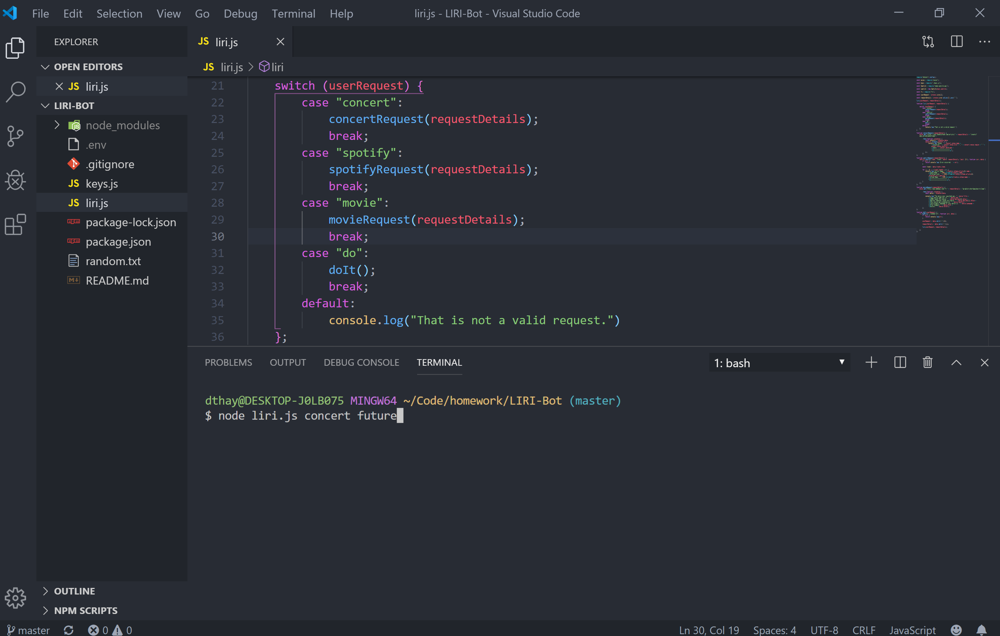
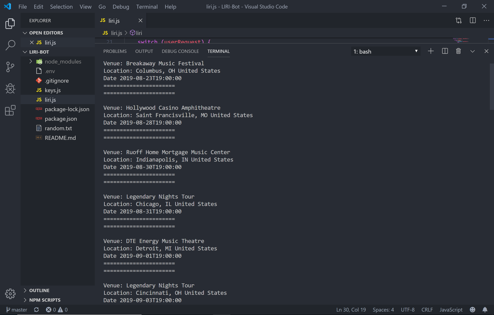
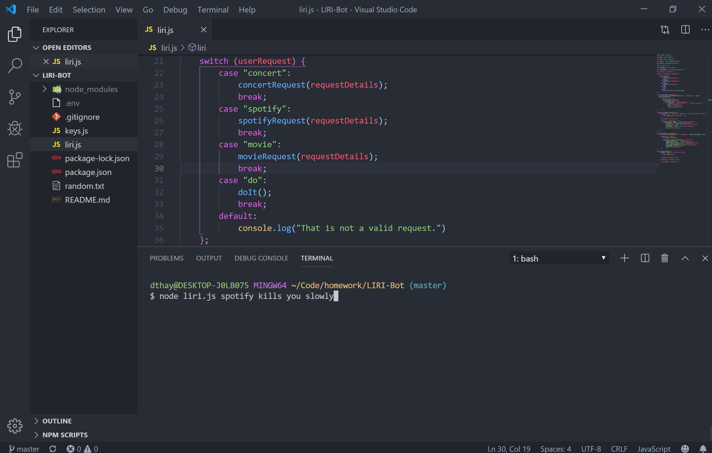
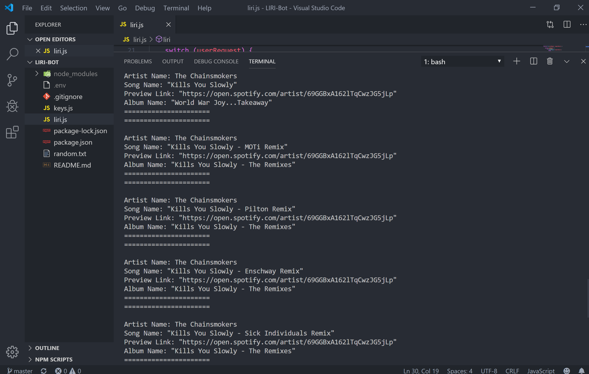
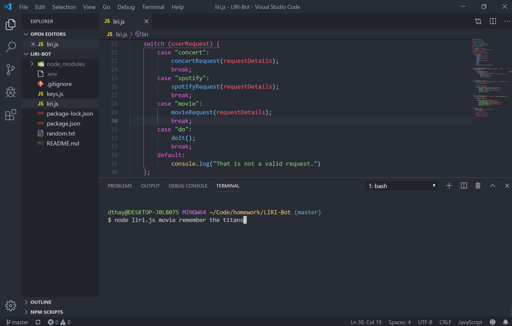
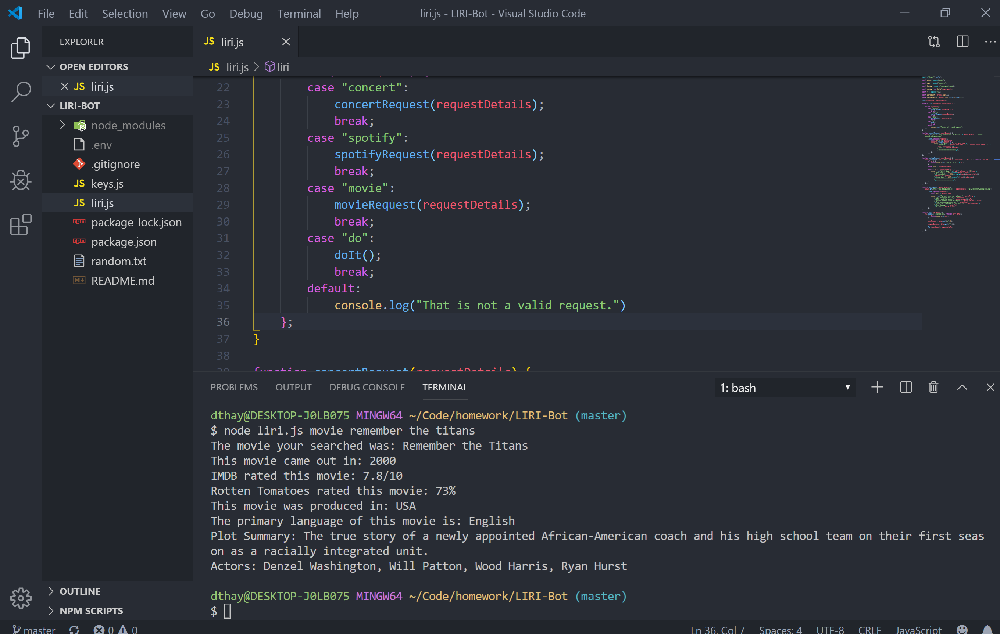
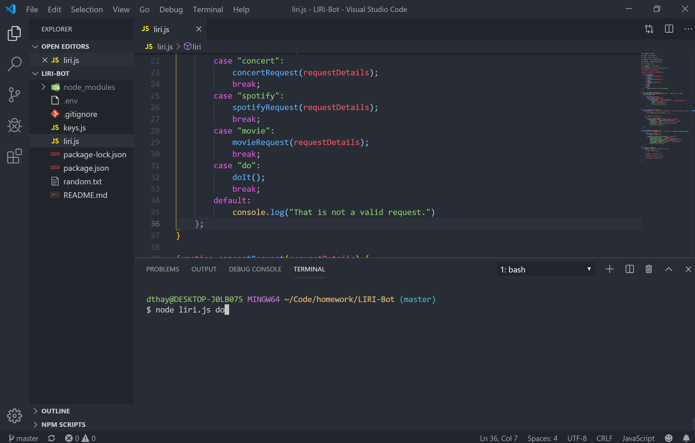
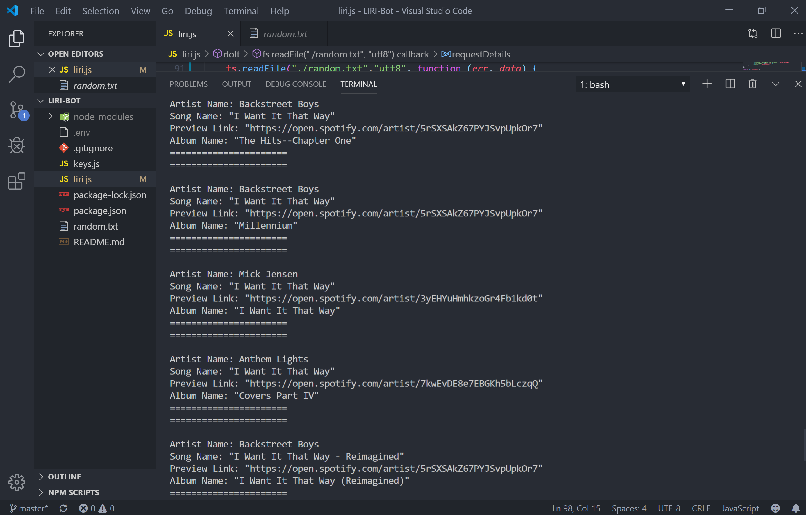

# LIRI-Bot
CLI App Node.js

#Concert Prompt
Takes in the user request of concert and the details of the artist.

#Concert Results
Based on the user request provides a list of upcoming concerts for user's requested artist.

#Spotify Prompt
Takes in the user request of spotify and the details of the song.

#Spotify Results
Based on the user request provides a list of matched songs for user's requested song.

#Movie Prompt
Takes in the user request of movie and the details of a movie title.

#Movie Results
Based on the user request provides a matched movie for user's requested title.

#DoIt Prompt
Uses the default request in the random.txt file.

#DoIt Results
Provides the user with a popular song request from the year 2000.

